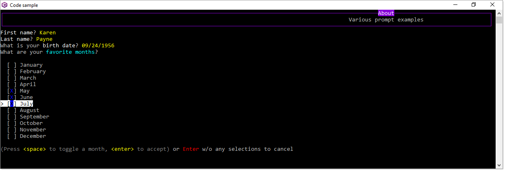

# About

Basic pre-validation

Let's say we ask for a person's' last name which needs at least five characters. Using `Spectre.Console.TextPrompt` (which is generic that works with string, int, decimal, DateTime etc

We can use it's `Validate` method to ensure five characters are entered.

Not done here, post validation on the model, it's the same as other examples. The focus here is working with accepting input in a console application.

```csharp
public static string GetLastName() =>
    AnsiConsole.Prompt(
        new TextPrompt<string>("[white]Last name[/]?")
            .PromptStyle("yellow")
            .Validate(value => value.Length switch
            {
                < 5 => ValidationResult.Error("[red]Must have at least five characters for last name[/]"),
                _ => ValidationResult.Success(),
            })
            .ValidationErrorMessage("[red]Please enter your last name[/]"));
```

