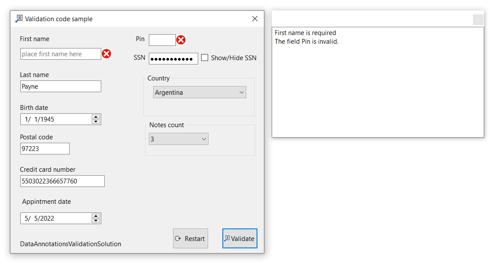

# About

Shows how to validate a form in a project and display errors in a child form. When the parent form move the child form moves too. If the child form is not open when needed it will be opened.

