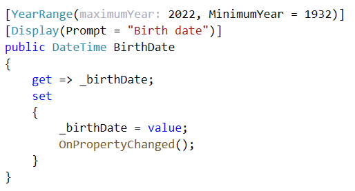

# Validating application data with Data Annotations

Validation is the first and most important step in securing an application. It prevents the application from processing unwanted inputs that may produce unpredictable results. Couple validation with properly transmitting data to a data source.

When validating data should there be instant feedback? This is subjective, instant feedback will be better when there are many inputs so this would be better than waiting to submit their input. In the case of instant feedback there needs to be events triggered to perform validation while on submit there is a central generic method to perform validation.

Let's take another view of validating on submit, with all types of application which can be created with Visual Studio there are methods which permit displaying messages to assist the user to correct mistakes. So back to subjective, it may come down to if code is written in a team or individual in regards to, are there team rules or it's the Wild West.

# Data Annotations

Data Annotations are nothing but a set of `attributes` which can be used to configure your model classes to validate the input data entered by users. It provides a set of `.NET attributes` that can be applied to data object class properties. These attributes offer a very declarative way to apply `validation rules` directly to a model. Data Annotations are a general purpose mechanism which can be used to feed `metadata` to the `framework`. Framework drives validation from the metadata, and uses the metadata while building the HTML to display and edit models. Well, you can manually validate the view model is ASP.NET Core and Windows Forms too, but using data annotation makes you `validation logic reusable` and also saves time. In addition, it also minimizes the complexity in the action methods. The idea is to add `constraints` metadata to `the properties` in the view model (or in Windows Forms), which can be later picked up by the default binder in the model-binding process.

| Project        |   Description    |
|:------------- |:-------------
| ValidatorLibrary | Base methods needed for validating a model with data annotations which matches code in `BaseDataValidationLibrary` without rules and extras past performing a model validaton. |  
| ValidatorLibraryTestProject | unit test for `ValidatorLibrary` project |  
| RulesLibrary | This project holds any data annotation rules which are common to a team or individual developer's work. |  
| RulesUnitTestProject | Unit test for `RulesLibrary`  |
| BaseDataValidatorLibrary | For teaching, for real work use ValidatorLibrary/RulesLibrary  |  
| EntityFrameworkCoreLibrary | For use with data annotation validations in `CustomerEntityFrameworkTestProject`. |  
| CustomerEntityFrameworkTestProject | Unit testfor `EntityFrameworkCoreLibrary` |  
| DirectoryHelpersLibrary | Provides methods to walk backwards in a directory structure. |  
| AnnotationValidationLibrary | For teaching |  
| ValidatingFormProject | Windows form project to try out validating a model |  

---

Besides provided annotations developers can create their own like shown below for validating the year value of a DateTime property in a model.

```csharp
[YearRange(maximumYear: 2022, MinimumYear = 1932)]
```



```csharp
[AttributeUsage(AttributeTargets.Field | AttributeTargets.Property)]
public class YearRangeAttribute : ValidationAttribute
{
    public YearRangeAttribute(int maximumYear)
    {
        MaximumYear = maximumYear;
    }
    /// <summary>
    /// Maximum permitted year
    /// </summary>
    public int MaximumYear { get; }
    /// <summary>
    /// Minimum permitted year
    /// </summary>
    public int MinimumYear { get; set; }
    public override string FormatErrorMessage(string name)
    {
        if (ErrorMessage is null && ErrorMessageResourceName is null)
        {
            ErrorMessage = "'Year {0}' and/or year '{1}' are invalid";
        }

        return $"{name} year must be between {MinimumYear} and {MaximumYear}";

    }

    public override bool IsValid(object sender) 
        => ((DateTime)sender).Year.Between(MinimumYear, MaximumYear);
}
```

